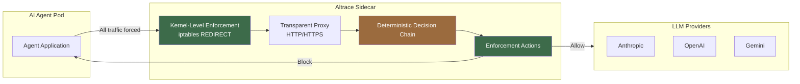
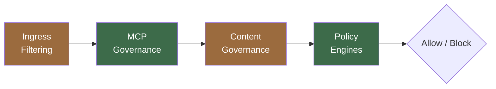

# Altrace Architecture (Public Overview)

> Topology and capability shape only. This overview intentionally omits internal
> stage ordering, detection parameters, pattern corpora, and tuning — those are
> proprietary. See the Product page for the buyer-facing version.

## 1. Agent Traffic Flow

## 2. Decision Chain — Category Bands

Every request flows through an ordered, deterministic 38-stage decision chain,
grouped here into governance categories. Each decision is a declared, reproducible
rule — not an opaque model. (Individual stage names and ordering are proprietary.)

## 3. Detection Depth

Inbound requests and outbound responses are both evaluated by multiple independent
detection layers, combined with a rigorous evidence-fusion step. The layers are
deliberately diverse, so that what one misses, another catches. Response-side
detection is unusual: it surfaces injection that *succeeded*, not just attempts.
Block decisions are fail-closed.

> Layer composition, signal parameters, and fusion thresholds are proprietary and
> are not published.

## 4. Deployment Modes

| Mode | Enforcement | Mechanism |
|------|-------------|-----------|
| **Kubernetes** | Governance-grade | Kernel iptables REDIRECT + DROP; agents cannot bypass |
| **Docker** | Advisory | Application-level; visibility, development, and testing |
| **Fargate** | Gateway | AWS Network Firewall → Altrace Gateway → providers |
