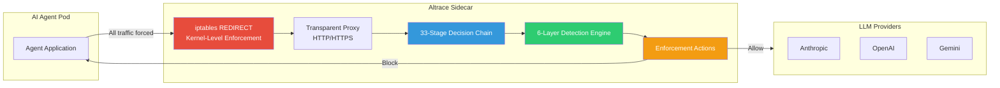
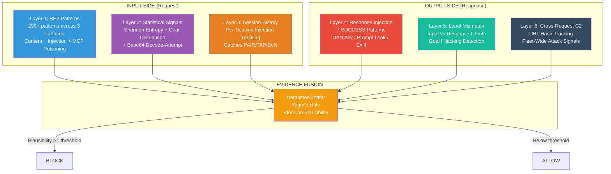
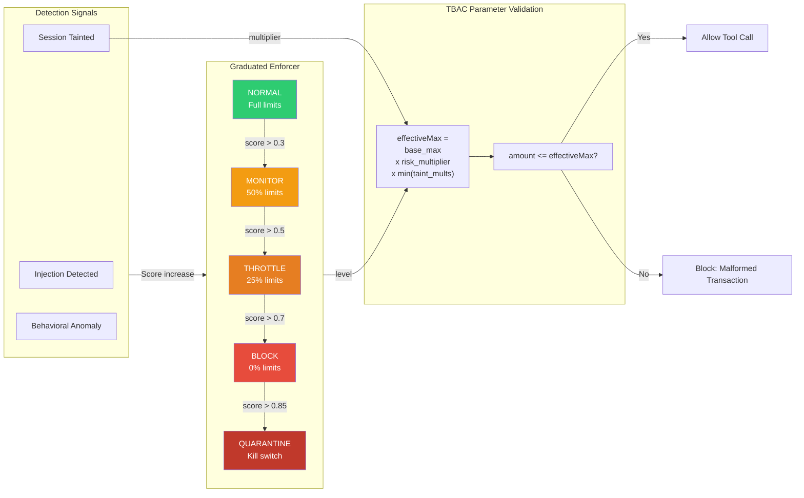
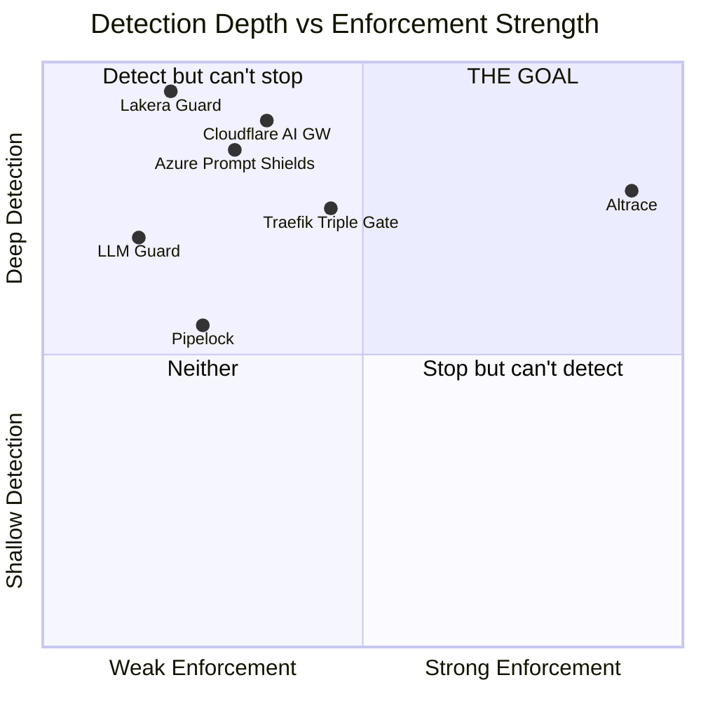
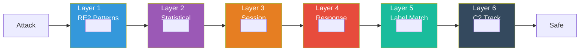

# Altrace Architecture Diagrams

## 1. High-Level: Agent Traffic Flow

## 2. Decision Chain (33 Stages)

```mermaid
flowchart TD
    subgraph Core["Core (0-1)"]
        D0[delegation]
        D1[manifest]
    end

    subgraph Ingress["Ingress Filter (2)"]
        D2[ingress_scan<br/>Prompt Injection Detection]
    end

    subgraph Access["Access Control (3-8)"]
        D3[policy]
        D4[model_filter]
        D5[mcp_registry]
        D6[mcp_reputation]
        D7[mcp_fingerprint]
        D8[mcp_attestation]
    end

    subgraph MCP["MCP Governance (9-14)"]
        D9[mcp_poisoning<br/>89 patterns]
        D10[tool_perm]
        D11[tbac + DAPC-1<br/>Dynamic Parameter Constraints]
        D12[evidence_grounding]
        D13[action_level]
        D14[approval_gate]
    end

    subgraph Budget["Budget & Risk (15-18)"]
        D15[cost_tool]
        D16[dow_breaker]
        D17[trust_contagion]
        D18[network_trust]
    end

    subgraph Content["Content Governance (19-25)"]
        D19[frontier]
        D20[taint_flow]
        D21[ssn_guard]
        D22[rtl_guard]
        D23[content_gov]
        D24[chain_detect]
        D25[prompt_registry]
    end

    subgraph Policy["Policy Engines (26-30)"]
        D26[external_classifier]
        D27[opa]
        D28[cedar]
        D29[cel]
        D30[allow_fallback]
    end

    Core --> Ingress --> Access --> MCP --> Budget --> Content --> Policy

    style Ingress fill:#e74c3c,color:#fff
    style MCP fill:#2ecc71,color:#fff
    style Content fill:#3498db,color:#fff
```

## 3. Detection Depth: 6 Independent Layers

## 4. DAPC-1: Dynamic Parameter Constraints

## 5. Competitive Positioning

## 6. Swiss Cheese Model: Why 6 Layers Matter

